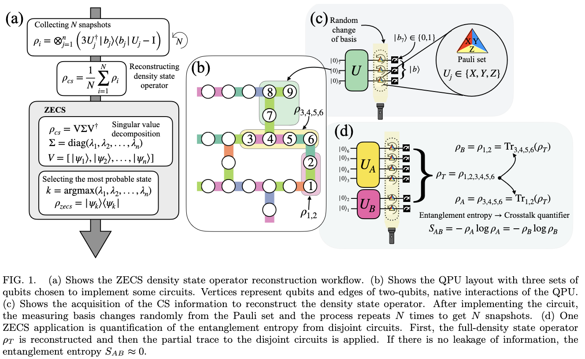

# A zero-entropy classical shadow reconstruction of density state operators

Classical shadow (CS) has opened the door to predicting the characteristics of quantum systems using very few measurements. As quantum systems grow in size, new ways to characterize them are needed to show the quality of their qubits, gates, and how noise affects them. In this work, we explore the capabilities of CS for reconstructing density state operators of sections of quantum devices to make a diagnostic of their qubits quality. We introduce **zero-entropy classical shadow (ZECS)**, a methodology that focuses on reconstructing a positive semidefinite and unit trace density state operator using the CS information. This procedure makes a reliable reconstruction of the density state operator removing partially the errors associated with a limited sampling and quantum device noise. It gives a threshold of the maximum coherent information that qubits on a quantum device have. We test ZECS on ibm\_lagos and ibm\_brisbane using up to 10,000 shots. We show that with only 6,000 shots, we can make a diagnostic of the properties of groups of 2, 3, and 4 qubits on the 127-qubits ibm\_brisbane device. We show two applications of ZECS: as a routing technique and as a detector for non-local noisy correlations. In the routing technique, an optimal set of 20 ibm\_brisbane qubits is selected based on the ZECS procedure and used for a quantum optimization application.  This method improves the solution quality by 10\% and extends the quantum algorithm's lifetime by 33\% when compared to the qubits chosen by the best transpilation procedure in Qiskit. Additionally, with the detector of non-local correlations, we identify regions of ibm\_brisbane that are not directly connected but have a strong correlation that maintains in time, suggesting some non-local crosstalk that can come, for example, at the multiplexing readout stage.

