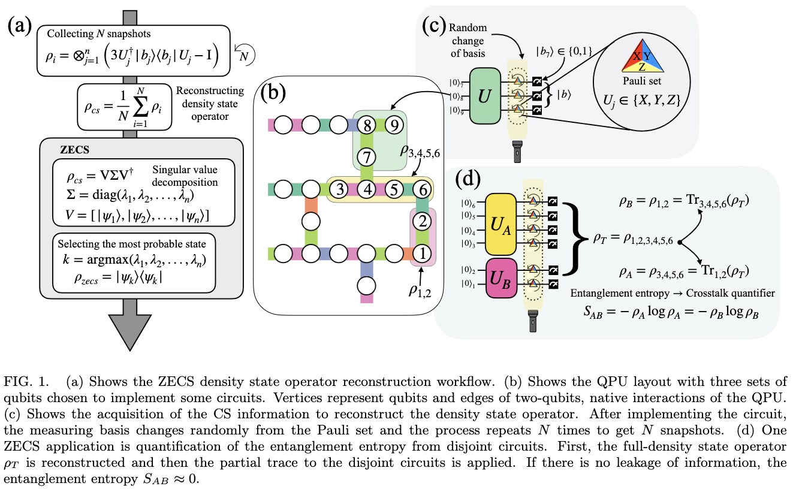

# Diagnosing crosstalk in large-scale QPUs using zero-entropy classical shadows 

As quantum processing units (QPUs) scale toward hundreds of qubits, diagnosing crosstalk and noise-induced correlations becomes critical for reliable quantum computation. In this work, we introduce Zero-Entropy Classical Shadows (ZECS), a diagnostic tool that reconstructs positive semidefinite, unit-trace density operators from classical shadow (CS) information. ZECS enables proper subregion tomography and reduces the effect of sampling and time-dependent errors. We apply ZECS to large superconducting QPUs, including ibm\_brisbane (127 qubits) and ibm\_fez (156 qubits), using 6,000 samples. With these samples, ZECS detects and characterizes crosstalk among disjoint qubit subsets across the full hardware topology. This information is then used to select low-crosstalk qubit subsets for executing the Quantum Approximate Optimization Algorithm (QAOA) on a 20-qubit problem. Compared to the best qubit selection via Qiskit transpilation, our method improves solution quality by 10\% and increases algorithmic coherence by 33\%. ZECS offers a scalable and measurement-efficient approach to diagnosing noise in large-scale QPUs.

